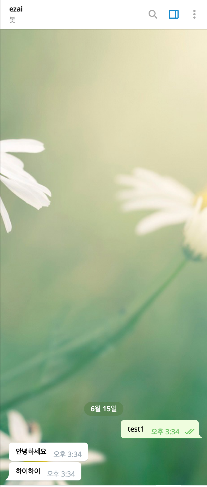
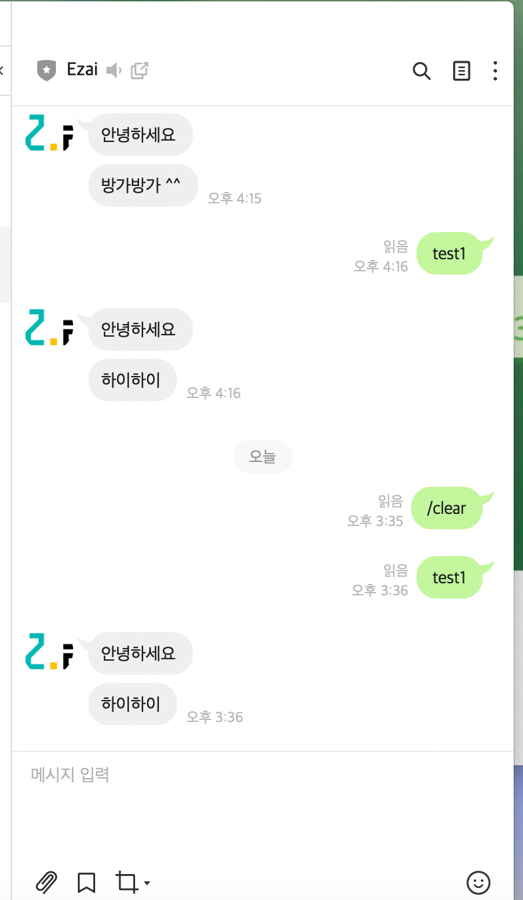

# ChatbotBuilder
### 챗봇을 만들어주는 챗봇 빌더

### 지원하는 플랫폼: 텔레그램(완료), 라인(완료), 페이스북 메세지(진행중)

### 프론트 관련 파일은 올리지 않음

-  내가 맡은 부분
  - 서버
    - 사용 언어 : JavaScript
    - 프레임워크: node/Express
    - 배포: aws ec2, 
    - 도메인 연결: Route53 + ELB (Https 연결) 
    - https://botezai.com (현재 ver1.2 배포 중, 마스터 권한 아이디만 동작함)
  - DB
    - Sql
    - AWS RDS 사용
  - 챗봇
    - line message api
    - telegram message api 

- 챗봇 동작 이미지

  - 텔레그램
    - {:width="100" height="100"}

  - 라인 
    - {:width="100" height="100"}